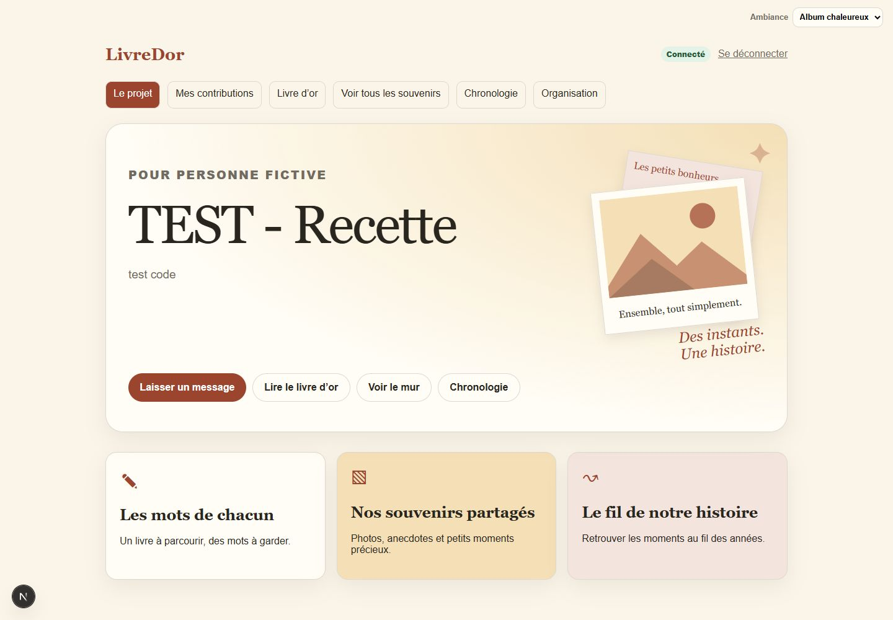
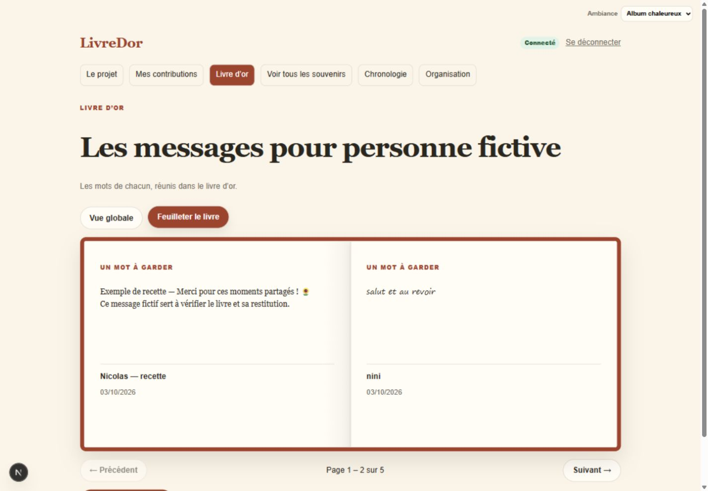
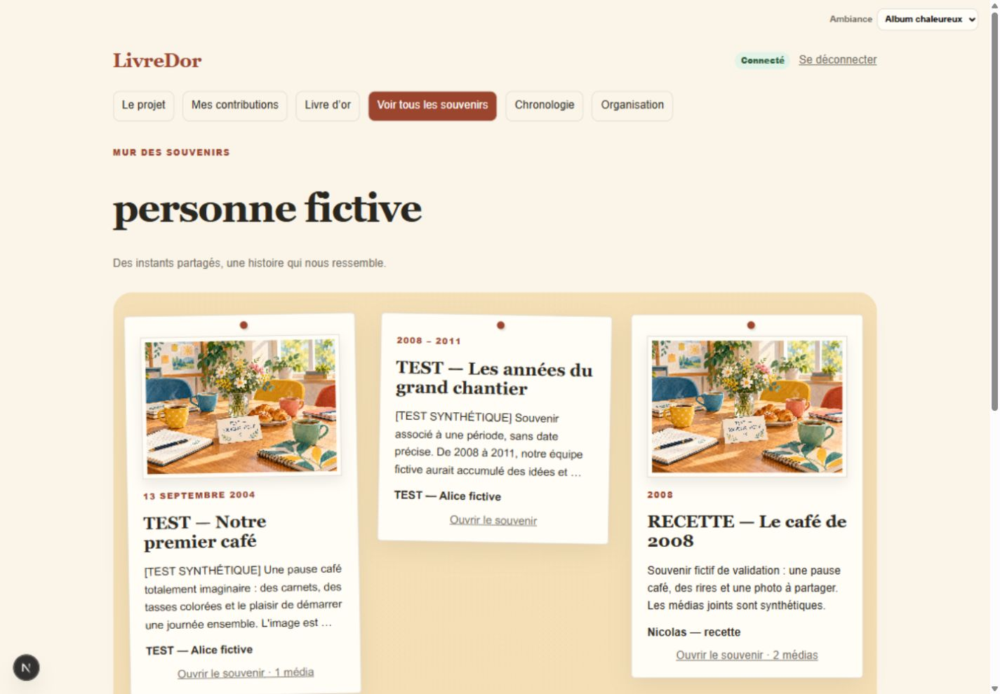

# LivreDor

Application de collecte et de restitution de souvenirs, développée et testable localement.

Version 0.1.2 : [nouveau parcours des souvenirs et recette de livraison](docs/21-RELEASE-0.1.2.md).

Version 0.1.3 publiée le 6 octobre 2026 : étapes pour
les contributeurs, contact organisateur par Resend, suppression définitive des
souvenirs par leur auteur, espacements et revue RGPD. Voir
[la release](docs/24-RELEASE-0.1.3.md) et
[le contrôle et les points restant à régler](docs/23-RGPD-ET-PARCOURS-CONTRIBUTEUR.md).
La limite de conservation des données hébergées est fixée à trois mois maximum
après l'événement ; le destinataire garde la restitution. L'activation du contact
nécessite les migrations 0010–0012, une clé Resend serveur et un expéditeur vérifié.
Ces migrations sont appliquées au Supabase configuré ; l'envoi local est testé.
Resend est configuré sur l'hébergement et appliqué au déploiement 0.1.3.
Site : https://livredor.nicho2.chatgpt.site ; réception email et recette personnelle restent à confirmer.

La version apparaît en pied de page. La création des projets est réservée aux
gestionnaires du site depuis `/all` : voir [configuration et gestion des thèmes](docs/20-GESTION-THEMES-SUPPRESSION.md).

[Recette Album chaleureux](docs/18-ALBUM-UI.md) ·
[Index de documentation](docs/README.md) ·
[Installation avec Resend](docs/15-INSTALLATION-RESEND.md) ·
[Jeu synthétique pour la recette en ligne](docs/16-SYNTHETIC-SEED.md).

## Objectif
Créer une expérience collective permettant de préparer un souvenir numérique pour une personne ou un événement : livre d'or, souvenirs, médias, chronologie et restitution finale.

## Aperçu de l'application

Pages réelles du projet de recette, avec des souvenirs de démonstration et le
thème **Album chaleureux**.







Retrouvez l'éditeur avec aperçu, la chronologie, le lecteur de souvenir et les
versions mobiles dans la [présentation en images](docs/19-PRESENTATION-VISUELLE.md).

## Stack retenue
- Next.js / React / TypeScript
- Supabase Auth (OTP email)
- PostgreSQL Supabase + RLS
- Cloudflare R2 pour les médias
- AWS SDK S3 pour signer les uploads R2
- Zod pour valider les entrées

## Démarrage local

```bash
cp .env.example .env.local
npm install
npm run dev
```

Puis ouvrir `http://localhost:3000`.

Avant de commiter une évolution :

```bash
npm run lint
npm run typecheck
npm test
npm run build
```

`npm run check` enchaîne ces contrôles et s'arrête au premier échec.
`npm run test:watch` signale immédiatement les régressions des tests unitaires
pendant le développement. La CI GitHub reprend ces contrôles et les migrations/RLS
sur PostgreSQL isolé, sans secret ni accès au projet Supabase réel.

L'accueil et l'écran de connexion peuvent être contrôlés sans backend. Le
parcours complet projet → OTP → contribution → mur nécessite une configuration
Supabase de développement et l'application de toutes les migrations.

## Configuration Supabase
1. Créer un projet Supabase.
2. Renseigner `NEXT_PUBLIC_SUPABASE_URL` et `NEXT_PUBLIC_SUPABASE_ANON_KEY`.
   Renseigner aussi `SUPABASE_SERVICE_ROLE_KEY` côté serveur uniquement.
3. Appliquer, dans l'ordre, les migrations de `supabase/migrations/`.
4. Activer l'authentification par email OTP.
5. Ajouter l'URL locale et l'URL de production dans les URL de redirection autorisées.

Pour recevoir un code dès la première connexion, inclure `{{ .Token }}` dans
les deux modèles d'email Supabase : **Confirm sign up** et **Magic link or OTP**.
Le premier sert à l'inscription, le second aux connexions suivantes. Le code
utilise `signInWithOtp` puis `verifyOtp` avec `type: "email"`.

Si Resend transporte ces emails, configurer le SMTP dans **Supabase**, pas une
clé Resend dans le navigateur : suivre [la procédure d'installation](docs/15-INSTALLATION-RESEND.md).

Voir `docs/10-LOCAL-VALIDATION.md` pour les vérifications de développement.
Pour un contrôle du navigateur Codex en panne après une mise à jour, voir
`docs/11-BROWSER-TROUBLESHOOTING.md`.

### Tests locaux de sécurité

Les tests unitaires utilisent le lanceur intégré et les hooks de modules de Node.js 24.
Sous Windows, avec `initdb`, `pg_ctl` et `psql` dans le PATH :

```powershell
./scripts/test-rls-local.ps1
```

Ce script crée une instance PostgreSQL isolée sur la boucle locale, applique les
migrations et teste les accès avec les rôles `anon` et `authenticated`. Il ne
contacte pas Supabase et n'utilise aucune clé. Il arrête l'instance à la fin ; les
fichiers temporaires et journaux sont conservés pour diagnostic. Le sandbox
Windows peut empêcher son démarrage et nécessiter une autorisation d'exécution.
Le schéma `auth` minimal de test ne remplace pas une vérification sur Supabase.

Après application des migrations à une **base Supabase de développement**, le
fichier `tests/sql/content-access.sql` peut aussi être exécuté dans l'éditeur SQL
avec un rôle administrateur. Ses données fictives sont annulées par `ROLLBACK` ;
il doit être exécuté en entier et pas sur une base de production.

## Plafond global des projets

Dans `.env.local` en local, ou dans les variables serveur de l'hébergeur :

```dotenv
LIVREDOR_MAX_PROJECTS=3
```

Valeur par défaut : 3. `0` suspend les nouvelles créations. Tous les projets
comptent, même fermés/archivés ; aucune donnée n'est supprimée si le plafond baisse.
Appliquer la migration `0006_project_quota.sql` et redémarrer le serveur après
changement d'environnement. Compter et créer est atomique en base ; le navigateur
ne peut pas imposer une limite différente. Garder la même valeur sur toutes les
instances utilisant ce Supabase. Ce n'est pas un quota global de volume média.

## Configuration Cloudflare R2
1. Créer un bucket privé.
2. Créer des credentials API R2 avec accès au bucket.
3. Renseigner les variables R2 dans `.env.local`.
4. Ne jamais exposer les credentials R2 côté client.

Voir `docs/12-R2-LOCAL-SETUP.md` pour le contrôle des identifiants et la règle
CORS de développement disponible dans `config/r2-cors.local.json`.

## Structure

```text
.
├── AGENTS.md                  # Instructions prioritaires pour Codex/agents
├── README.md
├── docs/                      # Spécification et décisions produit
├── supabase/migrations/       # Schéma SQL + RLS
├── src/app/                   # Routes Next.js
├── src/components/            # Composants UI
├── src/lib/                   # Clients Supabase, validation, R2
├── scripts/                   # Outils de préparation/export
└── .env.example
```

## État de la V1
La consultation exige une session OTP LivreDor, comme la contribution. Appliquer
la migration `0007_authenticated_read.sql` et publier le code correspondant pour
supprimer la lecture anonyme ; l'accueil reste accessible sans montrer les projets.
L’évolution ADR-026 (migration 0013) limite la lecture aux membres : un lien
partagé avec code aléatoire inscrit le compte après OTP. L’accueil affiche « Mes
projets » ; le gestionnaire retrouve tous les projets dans `/all`. Dans Organisation,
« Copier le lien d’invitation » prépare le même lien pour tout le groupe ;
« Renouveler le lien » invalide l’ancien sans retirer les membres existants.
Appliquer 0013 avec le nouveau code. Les anciens simples visiteurs doivent
recevoir le nouveau lien ; les membres déjà enregistrés gardent leur accès.

La contribution OTP, les souvenirs multiples, les médias R2 privés, le mur,
la chronologie et le détail sont implémentés. L'espace organisateur permet
modération, clôture et export ZIP avec site autonome et sauvegarde privée.
Les paramètres et le thème partagé sont modifiables dans Organisation.
La création est réservée aux gestionnaires du site depuis `/all`, avec possibilité
de désigner un organisateur par email. L'installation actuelle nécessite toutes
les migrations 0001 à 0009 et la variable serveur `LIVREDOR_SITE_MANAGERS`.
Voir `docs/13-V1-OPERATIONS.md` pour démarrage, tests, exploitation et limites.
Le registre `docs/10-LOCAL-VALIDATION.md` distingue vérifications réalisées et
recette manuelle restant à faire avant une publication.

### État initial du socle (historique)
À sa création, ce dépôt était un **starter**. Le socle initial contenait :
- une architecture exploitable ;
- le modèle de données initial ;
- les politiques RLS de base ;
- l'authentification OTP ;
- le flux de contribution principal ;
- le mécanisme de pré-signature R2 ;
- les écrans de base mur/chronologie/admin ;
- une documentation suffisamment précise pour permettre à un agent de poursuivre sans réinterpréter le besoin.

## Ordre de travail initial (historique)
1. Faire fonctionner Supabase local/remote.
2. Valider le parcours OTP.
3. Créer un premier projet de démonstration.
4. Finaliser contribution + mémoire.
5. Finaliser upload R2.
6. Construire le mur.
7. Construire la chronologie.
8. Construire l'administration.
9. Construire l'export final.

Voir `docs/06-BACKLOG.md`.
