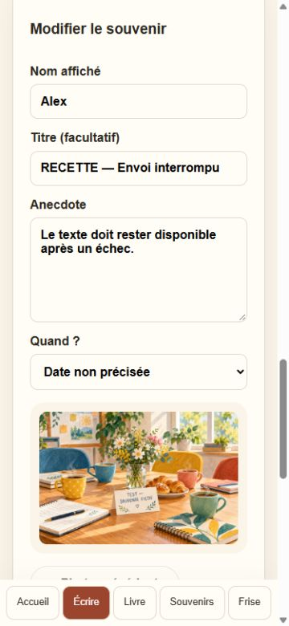
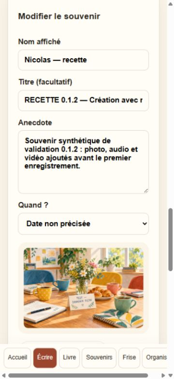

# Validation de développement — 3 octobre 2026

## Évolution invitation partagée — 8 octobre 2026

Recette complémentaire dans le navigateur intégré Codex réparé, en largeur
mobile 390 px, avec comptes et backend simulés : accueil vide avant invitation,
refus d'un projet non rejoint et d'un code invalide, conservation du lien pendant
la connexion OTP, adhésion puis retrait du code de l'URL, un seul projet sur
l'accueil et consultation du livre d'or. Côté organisateur, copie du même lien
à répétition, renouvellement avec changement du code et message de réussite,
puis liste gestionnaire vérifiés. Aucune erreur console ni débordement horizontal
sur l'accueil. Captures conservées dans `.archive-tests/`. Onglets fermés et
serveurs temporaires arrêtés ; ports 3140–3142 vérifiés libres. Cette recette ne
valide pas l'envoi réel des emails ni le site hébergé.

Migration 0013 testée sur PostgreSQL 18 jetable avec toutes les migrations et
anciennes suites : isolation des projets, messages, souvenirs et médias, code
incorrect ou d’un autre projet, email non confirmé, refus d’adhésion par UUID,
renouvellement, accès sans contribution, lecture après clôture, fenêtres de
contribution et invitation organisateur sur brouillon. Quota concurrent inchangé.
La base temporaire a été arrêtée.

Recette Edge invisible à 390 px contre des données en mémoire : OTP depuis
l’accueil puis l’invitation, connexion de l’en-tête conservant le code, refus d’un
autre projet, adhésion sans contribution, « Mes projets », retrait du code de
l’URL et consultation du livre. Recette organisateur : copie d’un lien stable,
renouvellement avec confirmation, annuaire `/all`, aucun débordement horizontal.
Aucun compte réel, email ou média R2 utilisé. Les navigateurs et serveurs de
recette sont fermés en fin de test.

45 contrôles HTML/API sur Next.js et Sites : aucune donnée dans le HTML anonyme,
invitation réservée à l’organisateur, code 256 bits, lien stable, renouvellement,
annuaire global réservé au gestionnaire et absence de cache. Lint, TypeScript,
53 tests unitaires et compilations Next.js/Sites sont contrôlés. L’outil de jeu
synthétique rejoint désormais les projets par invitation, avec lecture du projet
après connexion organisateur. Les identifiants d’invitation ne sont pas journalisés.

L’outil Browser intégré n’a pas démarré (module du runtime absent après mise à
jour) ; recette effectuée via Playwright et Edge. Le proxy de recette relaie les
WebSockets HMR nécessaires à l’hydratation en développement.

**Livraison restante :** appliquer 0013 sur Supabase avec le nouveau code, vérifier
un OTP réel puis transmettre les nouveaux liens. Ces tests locaux n’appliquent
aucune migration distante et ne constituent pas une publication hébergée.

Livraison effectuée ensuite le 8 octobre : migration 0013 appliquée et droits
vérifiés, données existantes identiques avant/après dans la transaction ; Sites
version 9 réussie et release v0.1.4 publiée. Cinq pages HTTP 200 affichent 0.1.4,
API invitation et annuaire refusées en anonyme (401), lectures anonymes Supabase
vides. Aucun email envoyé pendant cette livraison ; OTP réel et partage des
nouveaux liens restent à faire.

Projet testé : `depart-demo`, application locale sur `http://localhost:3000`,
base Supabase de développement distante. Aucun déploiement effectué.

## Vérifications réussies

- Connexion Supabase avec les clés locales ; les six tables métier sont accessibles.
- Authentification email activée et inscription autorisée.
- Première connexion OTP effectuée par l'utilisateur après configuration des
  modèles **Confirm sign up** et **Magic link or OTP** avec `{{ .Token }}`.
- Projet de démonstration créé et compte confirmé associé au rôle organisateur.
- Message principal et souvenir saisis par l'utilisateur : présents en base,
  tous deux `published`, accessibles au client anonyme.
- Trois souvenirs fictifs ajoutés via le client serveur de service, rattachés
  au compte organisateur et identifiés par le préfixe `TEST —`.
- Avant publication, les trois brouillons sont invisibles au client anonyme.
- Après publication, chaque souvenir est lisible par le client anonyme.
- Un souvenir modifié puis masqué reste conservé en base et devient invisible
  au client anonyme.
- Mur et chronologie : HTTP 200 ; les deux souvenirs fictifs publiés sont
  affichés et le souvenir masqué est absent.
- Chronologie : rendu de la date `12 juin 2015` et de la période `1998 – 2002`.

## Données fictives laissées dans le projet

- `TEST — Une journée mémorable` : publié, date exacte 2015-06-12.
- `TEST — Les premières années` : publié, période 1998–2002.
- `TEST — Brouillon puis masquage` : masqué, sans date.

Le message et le souvenir de l'utilisateur ont été conservés sans modification.
Le message principal étant unique par compte et projet, aucun second message
n'a été ajouté sous son compte.

## Limites et contrôles restant à réaliser

Les écritures des données fictives utilisent la clé de service : elles ne
valident pas les permissions d'écriture RLS d'un contributeur. Les contrôles
de visibilité utilisent la clé publique sans session et exercent la RLS de
lecture. Le compte de l'utilisateur étant organisateur, son parcours ne prouve
pas à lui seul les permissions d'un contributeur ordinaire.

Le contrôle du navigateur, initialement indisponible à cause d'une version
manquante dans le cache du plugin après mise à jour, a été réparé. La liste des
onglets, la lecture de la page de contribution et son actualisation sont
vérifiées. La session retrouve le message et les souvenirs après chargement.
Voir `11-BROWSER-TROUBLESHOOTING.md` pour la procédure reproductible.
Les clics brouillon/modification/masquage restent à vérifier dans l'interface.

Restent notamment : tests entre deux contributeurs et deux projets, tentatives
d'écriture anonymes, unicité du message principal, retour de session, fermeture
du projet, rendu de la personnalisation et ordre chronologique mixte
dates/périodes. R2 n'est pas configuré et les médias ne sont pas testés.

## Reprise du développement — sécurité et dates

Migration `0003_content_access_guards.sql` **appliquée à la base Supabase de
développement le 3 octobre 2026**, avec confirmation de l'utilisateur :
`Success. No rows returned`. Elle conditionne les lectures publiques à la visibilité du
projet, les écritures des contributeurs à sa fenêtre d'ouverture, et conserve
la modération par l'organisateur après clôture. Des triggers empêchent de
changer le projet ou l'auteur d'un contenu. Les règles média vérifient le
rattachement au souvenir et cachent les médias d'un souvenir non publié.

Vérifications locales effectuées sur une instance PostgreSQL 18 temporaire :
les trois migrations s'appliquent ; 21 assertions passent avec les rôles
`anon` et `authenticated`, deux contributeurs et un organisateur. L'instance
est arrêtée en fin de test et toutes les données de test sont annulées.
Le schéma `auth` est une émulation minimale : il reste nécessaire de valider
la migration et le parcours authentifié sur Supabase de développement.

Six tests unitaires passent : dates réelles/bissextiles, périodes ordonnées,
bornes des années, exclusion date/période simultanées, longueur des champs
et personnalisation bornée. Les mises à jour et masquages des souvenirs
exigent désormais une ligne retournée : un refus RLS filtrant toutes les
lignes ne peut plus être annoncé comme un succès.

`npm run lint`, `npm run typecheck`, `npm test` et `npm run build` passent.
PostgreSQL et le build nécessitent une exécution autorisée hors sandbox sur
cet environnement Windows (accès refusé dans le sandbox).
Ni données Supabase existantes, ni secrets, ni publication n'ont été modifiés.

### Contrôle après application sur Supabase

Vérification API en lecture seule : `is_project_public` retourne `true` pour
`depart-demo` ; `can_contribute` retourne `false` sans session ; un message
principal et trois souvenirs restent accessibles au client anonyme.
Ces contrôles ne remplacent pas les tests d'écriture avec plusieurs sessions.
Contrairement au bootstrap PostgreSQL minimal, le client anonyme peut appeler
`can_contribute` sur Supabase (qui retourne bien `false`) : les privilèges par
défaut de la plateforme restent à examiner si l'on souhaite interdire cet appel
lui-même. Les politiques d'écriture restent réservées à `authenticated`.

## Correction du parcours de connexion

Retour automatique après authentification, état partagé de session dans
l'en-tête et écran de connexion préalable aux formulaires de contribution.
La navigation n'utilise que des destinations projet locales validées.
Neuf tests unitaires (dont trois de navigation) passent, ainsi que lint,
TypeScript et build.

Dans le navigateur local déjà connecté : `/auth` mène automatiquement à
`/p/depart-demo/contribute` ; `/auth?next=%2Fp%2Fdepart-demo%2Fwall` mène au mur.
L'en-tête affiche « Connecté » et « Se déconnecter » sans adresse email.
La session utilisateur est conservée et aucune contribution n'a été modifiée.
Le nouveau cycle OTP et la déconnexion effective restent à vérifier : aucun
code n'a été redemandé et l'utilisateur n'a pas été déconnecté pendant ce test.

### Confirmation utilisateur et préremplissage du nom

L'utilisateur confirme ensuite avoir créé `TEST — Second contributeur` en
brouillon, s'être reconnecté, avoir retrouvé ses souvenirs et l'avoir publié.
Le cycle de reconnexion et la récupération du brouillon sont donc confirmés
manuellement ; les tentatives de modification des contenus d'un autre auteur
restent à vérifier sur Supabase.

Le nom affiché est désormais proposé à partir des contributions du compte
connecté dans ce projet (dernier souvenir, puis message, puis profil). Une
nouvelle saisie enregistrée devient la suggestion des souvenirs suivants.
Aucun email n'est utilisé et les noms des contenus existants restent inchangés.
Deux tests unitaires supplémentaires vérifient la priorité des suggestions
et le respect des champs modifiés ou explicitement vidés.

Vérification dans le navigateur connecté : le nouveau souvenir présente bien
un nom prérempli ; une saisie différente et l'effacement du champ sont respectés.
Le nom initial a été remis sans enregistrer. `TEST — Second contributeur` est
visible avec le statut publié. Aucun contenu existant n'a été modifié par ces
contrôles. Les 11 tests unitaires, lint, TypeScript et build passent.

## Nouveau contrôle multi-contributeurs local

Suite PostgreSQL isolée réexécutée à la demande de l'utilisateur : deux
contributeurs fictifs, un organisateur et deux projets. Les 21 assertions passent,
y compris la lecture des publications d'un autre auteur, la confidentialité des
brouillons, le refus de modification par un autre auteur et les restrictions
après clôture. Les identités sont simulées dans PostgreSQL, pas des comptes OTP
réels. Aucun compte n'a été créé dans Supabase et le projet de démonstration n'a
pas été fermé. Les fixtures sont annulées et l'instance locale est arrêtée.

La page de contribution filtre volontairement les souvenirs par auteur connecté ;
elle sert à gérer ses propres contenus. Le mur affiche les publications de tous
les auteurs. Ce comportement ne doit pas être confondu avec un refus RLS de lire
les contributions publiées des autres.

## V1 complète — médias, organisation et archive (3 octobre 2026)

Fonctionnalités implémentées : réservation média, PUT R2 direct avec progression,
vérification et copie finale immuable, GET signé privé, suppression avec masquage
puis effacement ; navigation projet commune, noms/styles bornés, détail des
souvenirs, chronologie mixte ; modération organisateur, fenêtre de collecte,
clôture, archivage ; ZIP avec site autonome et sauvegarde privée séparés.
Aucune nouvelle migration SQL n'est nécessaire pour ce jalon.

### Vérifications réellement réalisées

- `npm run lint` : zéro erreur, zéro avertissement.
- `npm run typecheck` et build Webpack de production : réussis.
- `npm test` : 17 tests unitaires passent (OTP/navigation, nom, dates/périodes,
  formats et tailles médias, tri chronologique, classes de style autorisées,
  exclusion brouillons/masqués et échappement des textes du site statique).
- Suite PostgreSQL 18 isolée réexécutée : 21 assertions RLS passent avec rôles
  anon/authenticated, deux auteurs, un organisateur et deux projets ; rollback
  des fixtures et arrêt de l'instance.
- `npm run test:integration` : 33 contrôles des **API Next compilées**, avec
  Auth/PostgREST fictifs **locaux** et stockage **R2 réel**, réussis. Ils couvrent
  session obligatoire/invalide, auteur/projet, taille/extension, PUT/CORS,
  finalisation, GET et contenu binaire identique, réutilisation du PUT sans
  écrasement final, parent brouillon privé, admin/export interdits au contributeur,
  clôture/modération, export ZIP extrait et média identique, exclusion brouillons
  et HTML utilisateur, suppression logique/physique, clé objet forgée refusée.
  Aucun compte Supabase créé, aucune session navigateur extraite : les objets R2
  de cette suite utilisent des UUID aléatoires et sont nettoyés au terme du test.
- Dans le navigateur avec la **vraie session Supabase** déjà ouverte : création
  de `TEST — Médias V1` en brouillon, upload d'une image PNG synthétique,
  finalisation et aperçu privé, publication et persistance au rechargement,
  lecture sur le mur et sur la page détail. Image décodée : 1 × 1 pixel.
  Aucun contenu existant d'un utilisateur n'a été modifié.
- Le compte contributeur actuel reçoit « Accès au projet refusé » sur la route
  organisateur ; il ne voit pas le lien Organisation ni les contenus administrateur.
- Largeur mobile 375 pixels : détail sans débordement horizontal ; viewport remis
  au réglage initial après test. La preuve visuelle est sauvegardée hors du dépôt.
- Client anonyme Supabase : le média du souvenir publié est lisible ; R2 sans
  signature refuse la lecture (HTTP 400). Ce dernier contrôle concerne l'endpoint
  S3, pas la configuration d'éventuels domaines publics du bucket.
- `npm audit --omit=dev` : zéro vulnérabilité connue. L'audit complet indique
  5 alertes élevées **dans les outils de lint** via `braces` 3.0.3. Le registre
  ne propose pas de version corrigée de cette dépendance ; aucun `audit fix
  --force` ni rétrogradation majeure de Next n'a été appliqué.

### Recette avant publication

Le parcours OTP/reconnexion a déjà été confirmé par l'utilisateur. Les tests
présents n'envoient pas un nouveau code et ne déconnectent pas sa session.
L'organisateur doit encore essayer visuellement son panneau avec son propre
compte et ouvrir son ZIP final après une clôture intentionnelle. Le projet
`depart-demo` n'a pas été clôturé pour les tests. L'API organisateur/export a été
testée automatiquement, pas avec une session réelle organisateur dans le navigateur.
La fixture HTTP n'est pas une preuve supplémentaire de RLS Supabase.

Les médias vidéo/audio/HEIC dépendent des codecs du navigateur : leur liste MIME
et leurs limites sont testées, mais seul l'aperçu PNG a été vérifié visuellement.
Avant déploiement : origine CORS réelle, configuration URL/OTP, revue consentements
et contenu, et recette mobile avec des fichiers représentatifs.
Voir `13-V1-OPERATIONS.md` pour utilisation, conservation et limites.

Sauvegarde par commits locaux ; aucun push et aucune publication réalisés.

## Création et organisation partagée — 3 octobre 2026

L'utilisateur confirme avoir terminé les cinq étapes de recette du socle :
filtres, masquage/republication, clôture, ouverture du ZIP et réouverture. Cette
confirmation complète la recette organisateur qui restait à faire ci-dessus.

Évolution : création authentifiée du projet et de son organisateur atomique
(0004), informations modifiables, invitation privée d'une deuxième adresse avec
acceptation par son compte à email confirmé (0005). Pas de date de naissance.

Vérifications réalisées :

- `npm run check` réussit : lint sans erreur/avertissement, typecheck, **23 tests
  unitaires**, build Webpack. Une relance a été nécessaire après un verrou EBUSY
  Windows ; aucun fichier utilisateur supprimé.
- **46 assertions SQL** passent sur PostgreSQL 18 isolé : les 21 du socle et
  25 nouvelles couvrant création, rôle initial, collision/identité immuable,
  non-auto-promotion, email privé, mauvaise adresse, adresse non confirmée,
  acceptation idempotente, deuxième organisateur, limite de deux et annulation
  en attente. Fixtures rollbackées et instance arrêtée.
- **55 contrôles d'intégration** passent sur les API compilées, Auth/PostgREST
  locaux et R2 réel : 33 contrôles du socle + 22 de création/paramètres/partage,
  incluant modération des paramètres, clôture/export par le deuxième compte et
  absence de son email dans l'archive. Objets R2 synthétiques nettoyés.
- Dans le navigateur avec la session organisateur réelle : affichage des nouvelles
  rubriques ; modification synthétique titre/nom/présentation, rechargement et
  consultation de la page ; valeurs originales restaurées. Un test de date a
  révélé une lecture d'état React obsolète après saisie native. Le formulaire lit
  désormais les contrôles via FormData à la soumission, avec test de régression.
  Après accord explicite de l'utilisateur, date du 3 octobre persistante au
  rechargement et affichée sur le projet ; ancienne date vide restaurée ensuite.
- `/nouveau` affiche les champs et le message d'activation manquante lors de la
  soumission : aucun projet Supabase créé. À 375 px, contenu 360 px, aucun
  débordement horizontal ; viewport restauré.
- En l'absence de migration 0005 distante, Organisation conserve les fonctions
  existantes et désactive le partage avec une explication.

Une nouvelle tentative SQL avec capture globale de sortie s'est bloquée sur les
handles Windows du serveur temporaire. Cette seule instance a été arrêtée,
puis le script relancé directement : les 46 contrôles ont réussi. Les journaux
temporaires sont conservés pour diagnostic, sans accès à la base utilisateur.

Activation distante réalisée le 3 octobre 2026, après autorisation utilisateur :
0004 puis 0005 exécutées intégralement avec `psql`, vérification TLS complète et
certificat officiel Supabase. Les objets étaient absents avant application.
Les empreintes des lignes des six tables métier sont identiques avant/après :
aucune contribution, aucun projet ni rôle existant modifié (1 projet, 3 messages,
8 souvenirs, 2 médias). Aucun compte créé et aucune invitation envoyée.

Onze contrôles de métadonnées passent : droits des fonctions, refus des appels
anonymes, RLS des invitations, politique organisateur, absence d'écriture directe
sur les invitations et trigger de protection d'identité. PostgREST reconnaît les
fonctions de création/acceptation et refuse leur appel anonyme (401 / 42501).
Le site local répond sur la page Organisation. Ces contrôles ne remplacent pas
la recette réelle. Le partage entre deux sessions OTP est désormais confirmé
par l'utilisateur ; la création réelle d'un nouveau projet reste à effectuer.
Les 46 assertions RLS ci-dessus concernent la base locale isolée.

La CI est configurée mais pas exécutée sur GitHub (aucun push demandé).
Voir `14-ONBOARDING-REGRESSION.md` pour activation et contrôles répétables.

## Documentation, Resend et jeu synthétique — 3 octobre 2026

- Relecture des références produit/architecture/sécurité ; index `docs/README.md`
  ajouté. Mentions d'activation 0004/0005 et de recette du deuxième organisateur
  corrigées. Le démarrage du socle est explicitement historique, pas une consigne
  de réinstallation sur la base existante.
- Le dépôt distant configuré n'annonce aucune référence HEAD/main/master lors
  de deux contrôles `git ls-remote` réussis. La documentation n'est donc pas
  publiée sur une branche distante vérifiée ; aucun push effectué.
- Procédure SMTP Supabase/Resend documentée à partir des références officielles,
  sans modification du compte SMTP ni ajout de secret ou dépendance Resend.
- Jeu `fixtures/seed-v1` préparé : quatre auteurs fictifs, quatre messages,
  huit souvenirs et cinq pièces jointes, dont deux images générées avec l'outil
  intégré, une vidéo FFmpeg H.264/AAC 6 s et un audio WAV synthétique 3 s.
  Signatures des fichiers testées ; `ffprobe` confirme le MP4 640 × 360 / yuv420p.
- Commande PowerShell testée en aperçu, sans backend ni réseau. Le mode Apply
  exige confirmation, OTP organisateur, même projet Supabase/site, titre TEST,
  slug test-, projet dédié et collecte ouverte. L'outil n'est pas une route web.
- **37 tests** passent, dont 13 nouveaux pour le seed et un contrôle de tous les
  liens Markdown locaux. SDK/API simulés vérifient sessions distinctes, aucune
  écriture de contribution sous clé service, uploads/finalisations, absence
  d'emails fictifs, collisions, reprise après panne et absence de doublons.
- Lint et typecheck réussis. Le premier build dans le sandbox Windows a échoué
  sur la canonicalisation SWC du chemin (accès refusé) ; relance autorisée hors
  sandbox réussie, sans changement de configuration ou protection Windows.
- **46 assertions SQL** repassées sur PostgreSQL temporaire isolé et arrêté ;
  première tentative sandbox interrompue pendant initdb, avant démarrage serveur.
- **55 contrôles d'intégration** repassés avec Auth/données HTTP locales et R2
  réel, objets synthétiques de cette suite nettoyés. Serveur compilé local relancé
  sur le port 3000. Les avertissements Node sur le type de modules TS restent
  connus ; aucune erreur de lint ni compilation.

Le nouveau seed n'a **pas** été lancé en mode Apply : aucun compte synthétique
ou souvenir créé sur Supabase pour cette tâche. Il n'est pas encore validé sur
un site déployé ; cette recette attend son URL et un projet TEST dédié.
Voir `15-INSTALLATION-RESEND.md` et `16-SYNTHETIC-SEED.md`.

## Plafond global des projets — 3 octobre 2026

L'utilisateur confirme la création réelle de `test-recette` depuis l'accueil et
son accès organisateur, puis une recette convaincante après alimentation
synthétique. Contrôle de comptage ultérieur : 5 messages, 8 souvenirs et 5 médias
dans ce projet (le test utilisateur peut ajouter du contenu). Aucune de ces
lignes n'a été modifiée pendant l'implémentation du plafond.

`LIVREDOR_MAX_PROJECTS=3` ajouté à `.env.local` ignoré et à l'exemple public.
La valeur par défaut est également 3 ; 0 suspend les créations, valeurs invalides
refusées explicitement. Le plafond compte tous les projets de la même base,
même fermés/archivés. Les détails de confiance serveur remplacent l'appel de
création utilisateur de l'ADR-012 : voir ADR-015.

Validation :

- `npm run check` réussit : lint, typecheck, **38 tests**, build Webpack.
- Les **46 assertions SQL du socle**, **12 assertions de quota** et un test avec
  **deux connexions concurrentes** passent sur PostgreSQL temporaire isolé.
  Une seule création réussit quand il ne reste qu'une place ; la seconde est
  refusée et ne laisse aucune adhésion orpheline. Instance arrêtée ensuite.
- **59 contrôles d'intégration** passent : plafond global, limite client rejetée,
  erreur HTTP 409 explicite, création atomique, socle/modération/ZIP et R2 réel.
  Les seuls objets R2 de cette suite sont nettoyés ; aucun projet utilisateur créé.
- Migration **0006 appliquée à Supabase** après contrôle des prérequis, avec TLS
  vérifié. Empreintes des six tables métier identiques avant/après ; **2 projets
  existants**, donc une place restante. RPC limitée accessible seulement au rôle
  service ; ancienne RPC interdite aux clients. PostgREST reconnaît les deux
  fonctions et refuse leurs appels anonymes sans effectuer d'insertion.
- Serveur compilé relancé sur 3000, nouvelle variable chargée, page locale OK.

Aucun projet réel supplémentaire créé pour simuler le dépassement. Documentation
et CI mises à jour ; commit local, aucun push ni publication.

## Consultation avec OTP obligatoire — 3 octobre 2026

L'ADR-017 remplace la consultation anonyme des projets et contenus. Migration
0007 préparée : quatre politiques réservées à `authenticated`, sans suppression
ni changement des droits de contribution/modération. Aucune donnée projet chargée
par le serveur dans les pages HTML/RSC ; chargement navigateur sous session/RLS.
La lecture média exige une session valide avant toute signature R2.

Validation locale : lint, typecheck, 38 tests unitaires, builds Next et Sites ;
82 contrôles d'intégration sur chacun des deux runtimes, dont absence de données
dans sept réponses HTML/RSC anonymes et refus média sans session/jeton invalide.
21 contrôles HTML seuls passent sans secrets ni accès distant. Suite PostgreSQL
isolée et quota concurrent réussis, instances temporaires arrêtées.
Le navigateur déconnecté affiche seulement l'invitation à se connecter sur le
mur local ; son lien OTP conserve `/wall` comme destination. Aucun OTP envoyé ni
nouveau compte créé. La session utilisateur connectée n'a pas été revalidée
dans le navigateur pendant ce changement.

La migration 0007 n'est pas encore appliquée à Supabase et le nouveau code n'est
pas déployé. La version en ligne reste donc en lecture anonyme jusqu'à ces deux
opérations autorisées et vérifiées. Aucun push GitHub ni données métier modifiées.

### Application et publication autorisées ensuite

Après accord explicite de l'utilisateur, migration 0007 appliquée avec TLS
vérifié et empreintes des six tables métier inchangées. Les lectures anonymes
directes PostgREST des quatre tables ne retournent aucune ligne. Version 3 Sites
publiée avec succès le 3 octobre à 18 h 41 (Paris), source `66a224b` : accueil,
connexion, projet, mur et chronologie HTTP 200 ; API média HTTP 401 sans signature
pour absence de session ou jeton invalide. Aucun push vers GitHub. La recette OTP
réelle sur la version 3 reste à confirmer ; les tests ne créent aucun compte.

## Recette Album chaleureux — 3 octobre 2026

Branche `feat/album-chaleureux`. Compilation Next.js/Webpack de production isolée
(`.next-ui`) réussie, avec services fictifs locaux et médias du seed, sans accès
au Supabase ni au R2 réels. Tests Playwright persistants dans
`tests/album-browser.mjs` : 12 scénarios (livre, éditeur, mur, chronologie à 1440,
900 et 375 px), plus thèmes/persistance, clavier et retrait des contenus après
déconnexion. Tous passent. Vérifications incluses : brouillon et publication,
mise en forme de l'aperçu, pages simples/doubles, galerie, zoom, audio, Échap,
focus restitué, lots de 24/30 souvenirs, 29 souvenirs datés, absence de débordement.
Les captures desktop/mobile sont dans `docs/screenshots/` avec données fictives.

`npm run lint`, `npm run typecheck`, les 38 tests Node et `git diff --check`
passent. Aucune migration ni modification des contrôles API/RLS. La fixture
valide l'UX et les interactions ; elle ne certifie pas les règles RLS réelles,
les signatures R2, tous les codecs vidéo ni les performances sur téléphone réel.
La réduction des animations est prévue via prefers-reduced-motion ; pas de
simulation système de ce réglage dans la recette Browser. Procédure détaillée :
[recette de l'album](18-ALBUM-UI.md).

### Correctif d'accès au port interne de la recette

L'ouverture directe de `localhost:3101` contournait le proxy Auth/médias et
pouvait produire `Failed to fetch`. Une redirection temporaire, uniquement sous
`LIVREDOR_UI_FIXTURE=1`, conserve chemin et paramètres et ramène vers `3100`.
Le lanceur annonce explicitement le lien à ouvrir et les identifiants fictifs.
Test Node ajouté : aucune redirection hors recette, aucun rebouclage du proxy.
Les 39 tests Node, lint, typecheck et build de recette passent. Playwright vérifie
le parcours réel `3101/auth` → `3100/auth` → OTP fictif → livre, puis le mur et
sa galerie. Le serveur de recette est laissé disponible pour l'essai utilisateur.

### Feuilletage animé et boutons aux extrémités

La rotation recto/verso dure 600 ms et respecte la réduction des animations.
Playwright vérifie à 1440, 900 et 375 px la présence d'une transformation
intermédiaire, les deux directions, la remise à disposition des commandes,
les curseurs neutres et la dernière page inchangée après une flèche droite.
Les trois scénarios existants de consultation du livre passent également.
Les 39 tests Node, lint, typecheck et build de recette passent.
Capture visuelle : [feuille en rotation](screenshots/livre-page-tournee.jpg).

## Parcours réel, volume et restitution — 3 octobre 2026

Sur la branche `feat/album-chaleureux`, recette locale avec Supabase et R2 réels
dans le projet « TEST - Recette », explicitement désigné par l'utilisateur.
Un message « Exemple de recette » et un souvenir « RECETTE — Le café de 2008 »
ont été publiés, avec une photo et un signal audio synthétiques. Aucun contenu
préexistant n'a été remplacé. Déconnexion, OTP réel, retour à la chronologie
demandée, lecture depuis mur/frise et photo décodée sur mobile (375 px) vérifiés.
Les exemples sont conservés pour l'essai utilisateur. Ni email ni OTP dans Git.

Après accord explicite de clôture/export/réouverture, le serveur a préparé le
ZIP réel avec les médias. Le navigateur automatisé n'a pas confirmé le fichier
enregistré sur disque (événement et récupération du téléchargement indisponibles).
La confirmation « téléchargée » a été corrigée en « prête », avec un lien visible
de récupération conservant le ZIP préparé. Présence du lien et URL blob vérifiées.
La confirmation native bloquait ensuite le navigateur ; la réouverture a été
effectuée côté serveur après vérification de l'ID, du titre et de l'état du seul
projet de recette, en préservant les dates. État final Supabase : `open`.
Confirmation utilisateur reçue ensuite : ZIP réel téléchargé et décompressé,
fichiers et répertoires attendus présents, puis `site/index.html` ouvert avec
tous les résultats attendus. Le parcours d'export réel est donc validé jusqu'à
la consultation de l'archive par l'utilisateur.

Tests indépendants : 85 contrôles sur Next compilé, Auth/données fictives et R2
réel, dont PUT/CORS/finalisation/lecture/suppression, clôture et inspection du ZIP
(média identique, brouillons privés, aucun lien signé). Fichiers R2 du test nettoyés.
Le site extrait du ZIP est vérifié avec Playwright à 1440 et 375 px : photo locale,
navigation par ancres, absence de scripts/brouillons et de débordement.
RLS et quota concurrent PostgreSQL isolés réussis, instance arrêtée.

Volume : 300 souvenirs et 6000 métadonnées sous un plafond HTTP de 1000 résultats
par requête ; les 300 compteurs de 20 médias passent à 1440 et 375 px. Chargement
par groupes de 24 IDs et index des médias par souvenir évitent troncature et
parcours répétés. Hauteur photo réservée pour limiter les déplacements de cartes.
Un message de 7650 caractères reste intégralement visible en lecture mobile.
La feuille animée est contenue dans le livre pour éviter un débordement temporaire.
La chronologie statique exclut maintenant les souvenirs non datés, conservés sur
le mur. Deux tests Node ajoutés (frise sans dates et archive de 300 souvenirs).

Captures : [souvenir réel](screenshots/recette-reelle-souvenir.jpg),
[lecteur mobile](screenshots/recette-reelle-mobile.jpg),
[export préparé](screenshots/recette-export-pret.jpg).

Validation finale : lint, typecheck, 41 tests Node, `git diff --check` et build
Next de recette réussis. Le livre avec message long passe également à 375,
900 et 1440 px, y compris pendant la transition, sans débordement horizontal.

## Gestion, thèmes et suppression — 0.1.1 (4 octobre 2026)

Branche `feat/project-themes-site-management`. 46 tests Node, lint et typecheck ;
builds Next de recette et Sites. Intégration API : 104 contrôles sur chacun des
runtimes, Auth/PostgREST fictifs et objets R2 jetables. Nettoyage des temporaires
et orphelins, conservation des autres projets, refus d'accès et thème de l'archive.
PostgreSQL isolé : RLS, quota concurrent, preuve d'export périmée, archivage,
verrou de suppression, délai des uploads, interdiction de modifier leur date et
cascades conservant les comptes. Instance de test arrêtée.

Playwright : huit thèmes enregistrés et persistants à 1440 et 375 px, version
visible, bouton absent de l'accueil, accès gestionnaire et double confirmation
de la zone de danger. Régressions livre, animation, mur, galerie, chronologie et
éditeur vérifiées. Le téléchargement de la fixture organisateur est un blob UX
fictif ; les vrais ZIP sont vérifiés séparément par l'intégration.

La migration 0008 et la configuration gestionnaire de l'hébergement restent à
appliquer lors du déploiement coordonné de 0.1.1. Aucun projet réel n'a été supprimé
et la base de production n'a pas reçu cette migration pendant la recette locale.

Correction de recette : `testDeleteFixture` clique désormais sur la suppression
après le parcours clôture → ZIP → archivage, vérifie le retour à l'accueil puis
l'absence du projet après rechargement. Simulation en mémoire, sans appel R2.
Les sessions fictives restent acceptées après redémarrage de la recette.
Les libellés distinguent la génération du ZIP, son lien de retéléchargement et
le changement d'état du projet. Build, lint, typecheck et Playwright réussis.

Création isolée : `testCreateFixture` vérifie le formulaire, l'accès organisateur,
la persistance après rechargement et le refus d'un lien existant sans écrasement.
Clôture, ZIP fictif, archivage et suppression du nouveau projet également vérifiés
dans le navigateur ; le projet synthétique initial reste disponible.

Désignation de l'organisateur à la création : 47 tests Node et 105 contrôles API
réussis, lint/typecheck/build Next réussis. PostgreSQL jetable : invitation
normalisée sans compte préalable, refus d'une autre adresse ou d'un compte non
confirmé, acceptation après confirmation et RPC inaccessible aux clients.
Playwright : champ email, création, invitation privée persistante et doublon de
lien vérifiés. Migration 0009 préparée pour le déploiement ; aucune base réelle
modifiée pendant ces tests.

## Mise à jour après publication et audit — 4 octobre 2026

Les mentions « à appliquer » ci-dessus décrivent la recette avant publication.
Le registre `17-SITES-DEPLOYMENT.md` confirme ensuite l'application de 0008/0009,
la configuration du gestionnaire et la publication de 0.1.1. Lors de l'audit,
Sites confirme à nouveau le statut `succeeded` du déploiement de version 6.
GitHub/main et HEAD avant corrections de documentation correspondent à `105b27a`.
Lint, typecheck et 47 tests Node sont relancés avec succès. Les contrôles API,
RLS et navigateur antérieurs ne sont pas relancés ; la recette réelle en ligne
de 0.1.1 reste ouverte.

## Contribution souvenir simplifiée — changements locaux après 0.1.1

Ajout de fichiers dès le formulaire, envoi après sauvegarde automatique en
brouillon et publication seulement après finalisation. Publication directe
d'un brouillon depuis sa carte. « Modifier » défile vers le titre du formulaire
et y place le focus, avec respect de la réduction des animations.

Lint, typecheck, 49 tests Node et build Next de recette réussis. Les tests d'envoi
vérifient progression, refus avant réservation et nettoyage lors d'un échec PUT
ou de finalisation. La recette navigateur isolée vérifie photo à la création,
brouillon, publication directe, texte prérempli et focus visible ; scénarios
réussis sur ordinateur puis à 375 px. Échec du deuxième fichier après un premier
envoi réussi : brouillon et sélection restante conservés, premier fichier présent,
puis publication sans doublon après retrait du fichier refusé.

Les scénarios sont dans `tests/memory-editor-browser.mjs`. La fixture simule les
fichiers en mémoire ; aucun Supabase/R2 réel n'est contacté. Une seconde recette
peut être lancée avec `LIVREDOR_UI_FIXTURE_PORT=3200` sans remplacer celle de 3100 ;
le build correspondant utilise également cette variable et les clés publiques
fictives du port choisi. Ces changements ne sont pas encore déployés.

## Nettoyage des serveurs de recette

Les serveurs de test sont arrêtés à la fin des vérifications, sauf demande
explicite de les conserver. Arrêt des processus LivreDor et de leurs enfants
confirmé le 4 octobre : ports 3000, 3100, 3101, 3200, 3201, 3202 et 54329 libres.
Le lanceur de recette ferme aussi ses serveurs HTTP quand Next s'arrête ou
échoue ; sous Windows, son arrêt vise l'arbre de son propre processus Next.

## Livraison 0.1.2 — 4 octobre 2026

Lint, typecheck, 49 tests Node, compilation Next et compilation Sites réussis.
Les 105 contrôles API passent pour Next et pour Sites ; les 27 contrôles HTML
Sites passent. Les objets R2 synthétiques sont nettoyés après recette.
Les migrations 0001–0009 et tests RLS/quota passent sur PostgreSQL jetable.
Le script audit-supabase-rls.mjs confirme en lecture seule sur le Supabase
configuré : RLS sur les sept tables, quatre tables sans lecture anonyme et
cinq fonctions d'administration interdites aux clients. Cela complète la
recette isolée sans écrire dans la base hébergée.
Le script check-client-secrets.mjs contrôle 30 fichiers client compilés sans
identifiant serveur ni email gestionnaire détecté.
Préparation d'information et de conservation : document 22 ; décisions de
l'organisateur et recette sur téléphone réel encore attendues.
Les médias synthétiques WAV (3 s) et MP4 (6 s) sont décodés dans le navigateur
avec commandes de lecture et readyState 4. Cela ne valide pas tous les codecs
ni les performances d'un téléphone réel.

## Recette en ligne 0.1.2

Version Sites 7 publiée au commit 175548d, deux CI GitHub réussies. Sur le projet
TEST uniquement : création avec PNG/WAV/MP4, brouillon et publication directe,
édition préremplie, focus/défilement à 24 px du haut en format 375 × 812 px.
Photos chargées et médias décodés depuis R2. Voir le registre 17 pour les limites.

## Préparation locale 0.1.3 — contact et information

Le 4 octobre 2026 : lint, TypeScript et 52 tests unitaires passent. La migration
0010 et ses contrôles RLS, idempotence, quota et cascade passent sur PostgreSQL
jetable. Les contrôles d'intégration Next.js et Sites passent chacun avec
116 vérifications ; aucune notification réelle n'est envoyée par ces tests.
Le parcours navigateur simulé vérifie l'échec email sans perte du texte,
l'envoi accepté et l'accusé de lecture organisateur.

Après clarification utilisateur, toute purge automatique et toute suppression
planifiée sont interdites. Les textes et consignes imposent une suppression
manuelle après vérification de la restitution, avant trois mois après l'événement.
La clé Resend, l'expéditeur et les mentions propres au responsable restent
attendus ; migration hébergée et activation publique ne sont pas réalisées.
La version en ligne reste 0.1.2. Aucun serveur de test ne reste en écoute sur
les ports contrôlés 3000, 3100–3102, 3200–3202, 3300–3301 et 54329.

### Diagnostic et recette réelle du 5 octobre 2026

Le formulaire local échouait avec PGRST202 : la migration 0010 n'était pas
installée sur Supabase. Application de 0010 sans suppression de données et
rechargement du schéma API. Sur le serveur 3000 lancé par l'utilisateur : un
message explicitement technique a été enregistré sur jcd et sa notification
acceptée par Resend, avec confirmation dans l'historique privé. La livraison
dans la boîte destinataire reste à confirmer. Le brouillon utilisateur a été
préservé ; aucun serveur supplémentaire n'a été lancé. Le serveur utilisateur
est conservé pour sa recette. Le message d'erreur API distingue désormais une
migration manquante d'un refus d'accès ou de quota.

### Suppression des souvenirs du 5 octobre 2026

Migration 0011 validée sur PostgreSQL jetable puis appliquée au Supabase configuré,
sans supprimer de contenu existant. Lint, TypeScript, 52 tests unitaires et builds
Next.js/Sites passent. Les tests d'intégration passent avec 125 contrôles sur
chaque runtime : refus anonyme/autre auteur, upload récent, conservation des
références en cas d'échec, reprise, suppression des objets R2 finaux/temporaires
et cascade des métadonnées sur des UUID synthétiques uniquement.
Le contrôle des 30 fichiers client compilés ne détecte aucun secret serveur.
La lecture du parcours local jcd confirme les cartes masquées de l'auteur et
« Supprimer » ; aucun souvenir utilisateur n'a été supprimé pendant la recette.
Organisation conserve sa modération. Serveurs de test arrêtés ; seul le serveur
3000 lancé par l'utilisateur reste ouvert. La livraison publique reste à faire.

### Correction de l'attente de suppression avec image

Migration 0012 testée sur PostgreSQL jetable puis appliquée au Supabase configuré :
une image récente publiée ou masquée ne bloque plus l'effacement ; un envoi
récent encore en brouillon reste protégé. Aucun contenu utilisateur supprimé.
Lint et TypeScript passent. Les 125 tests du runtime Sites passent avec une
image finalisée récente et le contrôle d'absence des objets R2 après suppression.
La confirmation explique simplement qu'une copie enregistrée sur un appareil
extérieur restera sur cet appareil. Aucun serveur supplémentaire conservé.

## Contrôle de préparation Git 0.1.3 — 6 octobre 2026

Sur la version finale : lint, TypeScript, 52 tests unitaires, compilation Next.js
dans un dossier isolé et compilation Sites réussis. Les 125 contrôles API/R2
passent pour chacun des deux runtimes. Toutes les migrations 0001–0012 et les
tests RLS, contact, quota concurrent et suppression passent sur PostgreSQL jetable,
arrêté après test. L'audit Supabase en lecture seule confirme TLS, huit tables RLS,
sept RPC réservées au serveur, deux RPC privées de contact et la correction 0012.
Les quatre tables de contenu restent vides pour le rôle anonyme.

La documentation décrit séparément code local, schéma Supabase installé et site
public 0.1.2. L'utilisateur prend en charge Resend hébergé ; aucune publication
n'est réalisée pendant cette préparation. Le contrôle des fichiers client et
des fichiers indexés Git complète la vérification des secrets avant commit.
