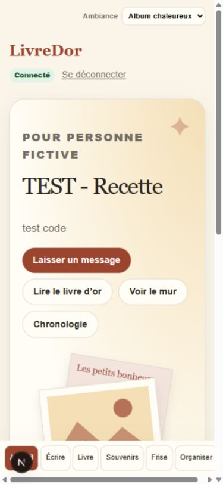
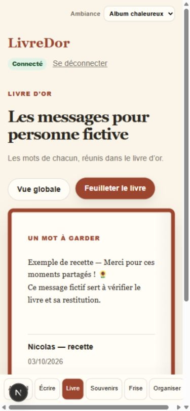
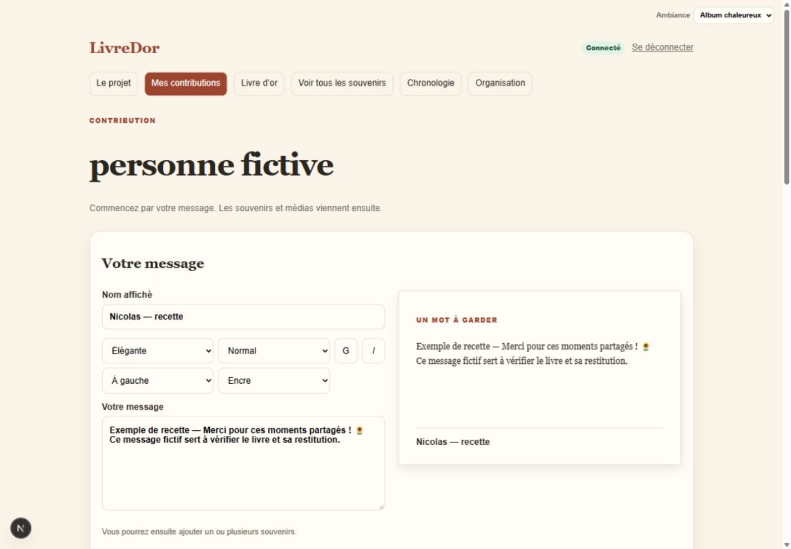
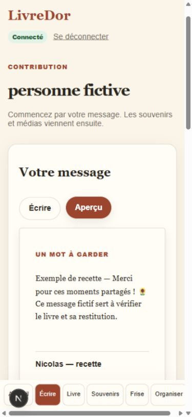
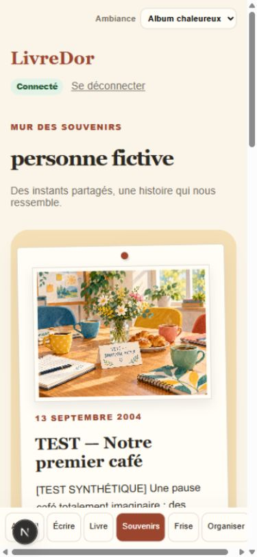
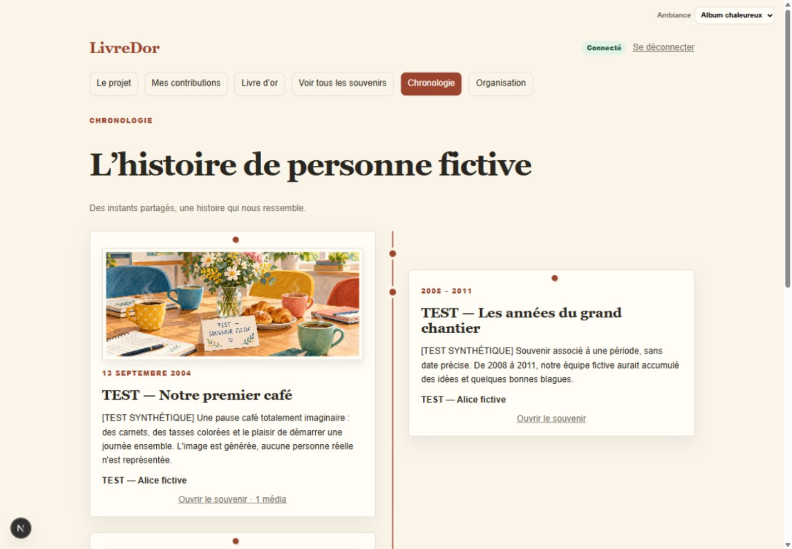
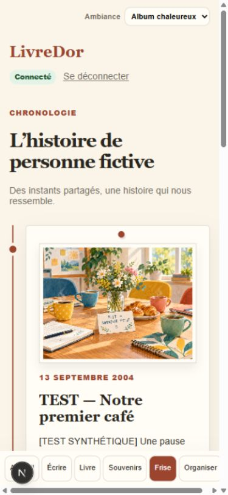
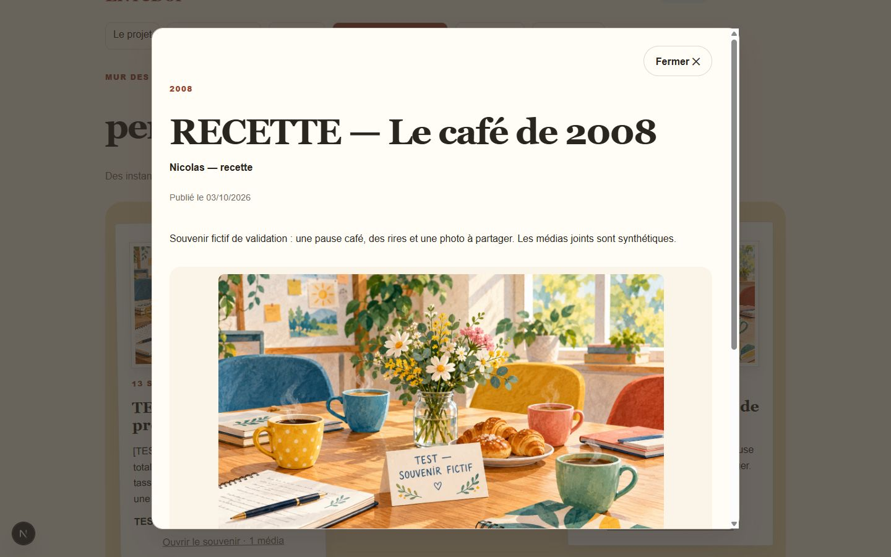

# LivreDor en images

Captures du 3 octobre 2026, prises dans l'application locale sur les pages du
projet « TEST - Recette », avec le thème **Album chaleureux**. Les souvenirs et
illustrations présentés sont des exemples de recette. Aucun email, code de
connexion ou lien de média signé n'apparaît dans ces images.

Les captures montrent l'application telle qu'elle fonctionne, sans retouche.
Le petit bouton Next.js visible en bas appartient au serveur de développement.
Les vues ordinateur utilisent une fenêtre de 1440 × 1000 px ; les vues mobiles
une fenêtre de 390 × 844 px, simulée dans le navigateur.

## Accueil du projet

Une couverture d'album et des accès directs pour écrire, lire ou retrouver les
souvenirs.

## Livre d'or

Les mêmes messages se parcourent en vue globale ou dans le livre. Deux pages
sont visibles sur ordinateur, une seule sur mobile. Le feuilletage est animé ;
une capture fixe montre ici le livre au repos.

## Écriture et aperçu

L'aperçu accompagne la saisie sur ordinateur. Sur mobile, les onglets Écrire et
Aperçu permettent de consulter le rendu avant publication.

## Mur des souvenirs

Des cartes papier avec photos, dates, auteurs et accès au souvenir complet.

## Chronologie

Les souvenirs datés s'organisent de part et d'autre de la ligne sur ordinateur,
puis le long d'une ligne verticale sur mobile. Le mur et la chronologie ouvrent
le même lecteur de souvenir.

## Souvenir et médias

Le lecteur réunit le texte et les médias du souvenir, avec galerie photo et
lecture audio. Cette capture provient du même parcours réel de recette.

La clôture, l'export ZIP et la réouverture ont aussi été vérifiés. L'utilisateur
a confirmé le téléchargement, la décompression et la consultation réussie de
`site/index.html`, avec les contenus attendus. Voir le
[compte rendu de validation](10-LOCAL-VALIDATION.md).
