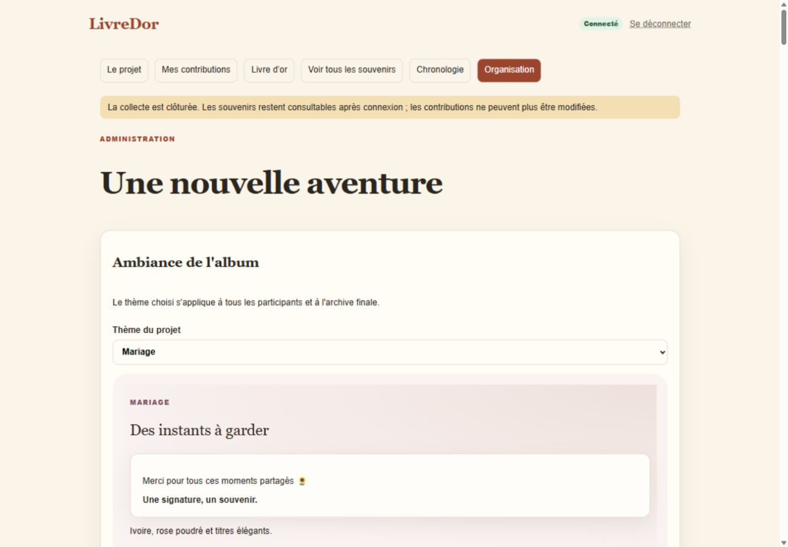
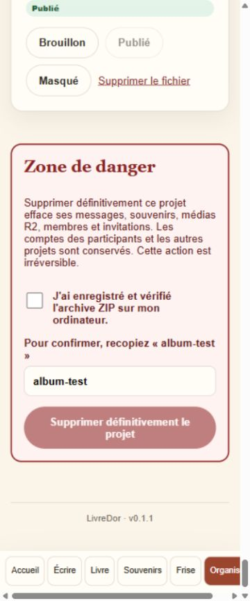

# Version, thèmes et gestion du site — 0.1.1

## Accès gestionnaire

L'accueil ne propose plus la création. Les projets restent consultables après
OTP comme auparavant. Le gestionnaire ouvre directement `/all` : après connexion,
il retrouve les projets et le bouton **Créer un LivreDor**. `/nouveau` est aussi
protégé, et l'API de création refuse un compte connecté non autorisé.

Configurer côté serveur, en local puis sur l'hébergeur :

```dotenv
LIVREDOR_SITE_MANAGERS=gestionnaire@example.invalid
```

Plusieurs adresses sont possibles, séparées par des virgules. Ce sont les emails
confirmés de Supabase Auth, pas les noms affichés. Valeur vide : aucune création.
Ne pas préfixer cette variable par `NEXT_PUBLIC_`. Aucun changement des rôles
organisateur/contributeur des projets existants.

À la création, **Email de l'organisateur** permet de désigner une autre personne.
Elle obtient les droits de ce seul projet lors de sa connexion OTP avec l'adresse
confirmée, y compris si son compte n'existait pas encore. Le gestionnaire conserve
aussi les droits organisateur. Champ vide : il reste seul organisateur.
Transmettre le lien du projet à la personne ; aucun email d'invitation automatique.
L'adresse est privée et exclue des exports. Migration 0009 nécessaire : projet
et invitation sont enregistrés ensemble, sans création partielle en cas d'erreur.

## Version et ambiances

La version apparaît en pied de page sur ordinateur et mobile et vient uniquement
de `package.json` (0.1.1). Mettre également à jour la version du lockfile lors
d'une livraison.

Organisation → **Ambiance de l'album** propose un aperçu et huit choix : Album
chaleureux, Classique, Retraite, Anniversaire, Mariage, Départ d'entreprise,
Naissance et Souvenir. **Enregistrer le thème** applique le choix à tous les
participants. Il est conservé après rechargement et dans l'archive autonome.
Les anciens projets utilisent Album chaleureux par défaut.



## Zone de danger

1. Clôturer la collecte et confirmer dans l'interface.
2. Télécharger le ZIP ; le décompresser et vérifier `site/index.html`.
3. Archiver le projet et confirmer.
4. Tout en bas, cocher la confirmation de sauvegarde, recopier le slug exact
   puis demander la suppression définitive.

Le serveur contrôle ces conditions et le rôle organisateur. Tout changement
des contenus ou du thème invalide l'export précédent : produire un nouveau ZIP.
Les projets déjà archivés avant cette version ont besoin d'un nouvel export,
car aucune preuve d'export antérieure n'est inventée.

En cas d'ajout média récent, attendre dix minutes après cet ajout. En cas d'échec
de nettoyage, actualiser Organisation et reprendre la suppression : le projet
reste bloqué pour empêcher une réouverture ou un changement pendant le nettoyage.
Les médias, messages, souvenirs, appartenances et invitations du projet sont
effacés ; les comptes et autres projets restent présents.



## Mise à niveau

Appliquer `supabase/migrations/0008_project_themes_archive_deletion.sql` et
configurer le gestionnaire avant de mettre en ligne le nouveau code. La nouvelle
règle d'archivage doit être livrée avec l'API qui confirme les exports.
La migration n'efface aucun projet ni contenu ; les suppressions demandées dans
l'interface sont des opérations séparées, irréversibles et explicites.

Les tests navigateur organisateur se lancent avec la fixture :

```powershell
node scripts/ui-fixture.mjs --production --organizer
```

Les assertions sont dans `tests/management-browser.mjs`. L'archive fournie par
cette fixture est un blob fictif pour le parcours UI, **pas un vrai ZIP**. Les
ZIP réels et la suppression R2 sont vérifiés séparément par
`scripts/test-v1-integration.mjs`, avec Auth/données fictives et objets R2 UUID
propres à chaque exécution. Les tests SQL lifecycle et RLS utilisent PostgreSQL
jetable, sans contact avec Supabase réel.
